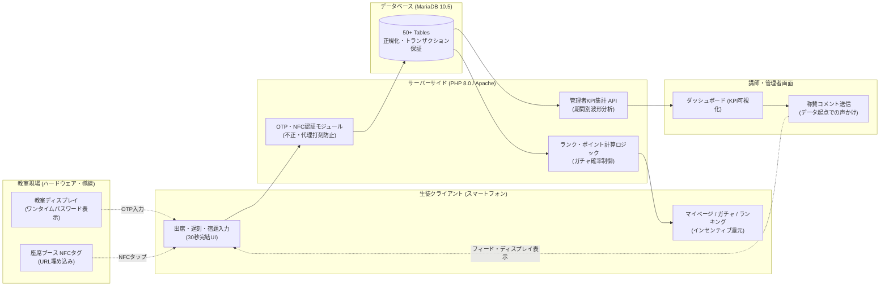
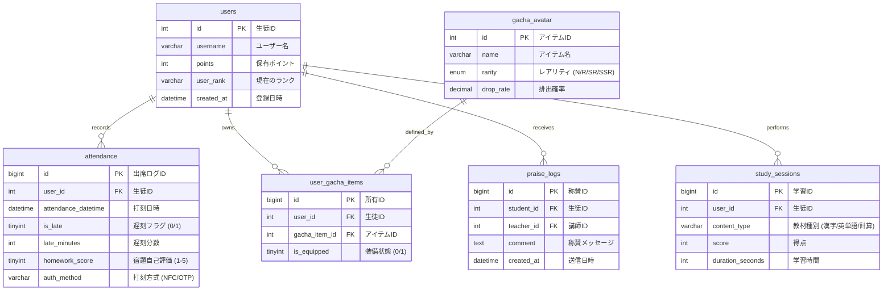

# スタサク (SUTASAKU)
### 個別指導塾向け 学習習慣定着・行動ログ解析Webプラットフォーム

[](https://www.php.net/)
[](https://mariadb.org/)
[](https://developer.mozilla.org/)
[](https://sutasaku.com)

---

## 📌 プロダクト概要 (Overview)

「スタサク」は、個別指導塾において生徒の基礎学習行動（出席・無遅刻・宿題達成）を習慣化・可視化するためのWebアプリケーションです。企画・要件定義・データベース設計・フロントエンド/バックエンド実装・現場導入・講師研修・効果検証（ログ解析）までを一気通貫で主導しました。

学習塾における生徒の成績向上のボトルネックは、教材や授業の質以前に**「日々の学習行動の継続性（遅刻しない・宿題をやってくる）」**にあります。しかし、日々の行動は点数のように客観評価されにくく、生徒自身も達成感を得にくい構造がありました。また、講師側の声かけも個人の記憶や熱量に頼る属人化した状態でした。

スタサクは、**「現場で使われなければ効果は出ない」**という制約のもと、授業開始前30秒で完了する低摩擦な入力導線を構築。行動ログを即時のインセンティブ（ランク・ポイント・ガチャ・称賛）に変換し、客観データに基づく指導オペレーションを確立しました。

---

## 📊 実運用データによる効果検証 (Quantitative Impact)

2025年4月〜2025年8月の5ヶ月間、自校舎（生徒83名・講師30名）において実運用を実施し、蓄積された**出席ログ1,703件**を対象に効果検証を行いました。

| KPI 指標 | 導入初期 | 運用5ヶ月後 (最終) | 改善率 / 実績値 | 統計・運用補足 |
|:---|:---:|:---:|:---:|:---|
| **無遅刻率** | **76.7%** | **97.7%** | **+21.0 pt (+27.4%)** | 期間中の全出席ログを対象とした集計 |
| **宿題達成度 (5点満点)** | **4.05** | **4.60** | **+0.55 pt (+13.6%)** | 全期間平均: **4.42 / 5.0** |
| **平均遅刻時間** | - | - | **0.71 分** | 教室全体で遅刻がほぼ消滅 |
| **初週アクティブ率** | - | - | **約92%** | 教室ディスプレイ・初期研修による定着 |
| **NFC打刻比率** | - | - | **27.2%** | スマホをかざすだけの超低摩擦導線が機能 |
| **宿題満点率 (出席ベース)** | - | - | **73.0%** | 自己評価★5の比率 |

```text
[無遅刻率の推移]
導入初期: 76.7% [███████████████████████░░░░░░░]
運用最終: 97.7% [█████████████████████████████░] (+27.4% 向上)

[宿題達成度の推移 (5点満点)]
導入初期: 4.05  [████████████████████████░░░░░░]
運用最終: 4.60  [████████████████████████████░░] (+13.6% 向上)
```

> **検証の誠実さ（バイアス分析）**:  
> 固定ユーザー（継続利用生徒）を対象とした分析における改善傾向のp値は **0.0522**（有意水準5%の境界線上）でした。「意欲の高い生徒だけが記録しているのではないか」という**任意打刻バイアス**に対しては、出勤日外の個別声かけや教室長との未打刻者フォローを実施。「自己申告の宿題評価が甘くなる」という**自己評価ブレ**に対しては、講師が宿題チェック時に定期照合・補正する運用ルールを設計してデータの信頼性を担保しました。

---

## 🛠️ システムアーキテクチャ & 現場制約の解決 (Architecture & Engineering)



### 1. 現場摩擦を極小化する打刻導線
- **OTP (One-Time Password) 認証**: 教室のメインディスプレイに日替わり/時間替わりのパスワードを表示。教室に来ていない生徒による不正打刻を防止。
- **NFCタグ連携**: 各個別指導ブースにNFCタグを設置。生徒がスマートフォンをかざすだけで打刻画面へ遷移し、認証から遅刻・宿題自己評価の登録までを**30秒以内**で完了。

### 2. 行動変容を支えるインセンティブ設計
- **努力の多面評価**: 単なる出席回数だけでなく、「連続無遅刻」「宿題満点継続」などの条件をクリアすることでランクが昇格。
- **期待値連動型報酬**: ランクが上昇するほど、ポイントで引けるアバターガチャの優良アイテム排出期待値が向上するロジックをPHPで実装。

### 3. 指導の属人化を防ぐ管理者機能
- **リアルタイムKPIダッシュボード**: 教室全体の出席数、平均遅刻時間、宿題評価推移を即座に把握。
- **称賛コメント機能**: 「宿題が3週連続満点」「遅刻ゼロ達成」といった客観ログを引用し、講師が生徒へ公式な称賛メッセージを送信。教室ディスプレイや生徒フィードに表示して承認欲求を満たす。

---

## 🗄️ データベース設計 (Database Schema)

正規化を徹底し、トランザクション分離と外部キー制約によりデータ整合性を担保しています（計50以上のテーブル群よりコアテーブルを抜粋）。



---

## 💻 技術スタック (Tech Stack)

| レイヤ | 技術要素 | 選定理由・役割 |
|:---|:---|:---|
| **Backend** | PHP 8.0 | レンタルサーバー環境での安定動作、セッション管理、バッチ集計 |
| **Database** | MariaDB 10.5 | リレーショナルデータの一貫性担保、インデックス最適化、トランザクション処理 |
| **Frontend** | Vanilla JavaScript, HTML5, CSS3 | 生徒端末のOS・ブラウザ（iOS Safari / Android Chrome）を問わない互換性と軽量性 |
| **Hardware** | NTAG213 NFCタグ, 教室ディスプレイ | 打刻時の操作摩擦をゼロにし、利用定着率90%超を支えるインフラ |
| **Web Server**| Apache 2.4 | `.htaccess` によるURLリライト、アクセス制御、SSL/TLS暗号化通信 |

---

## 💡 本プロジェクトから得たエンジニアリングの学び

1. **現場制約の克服がすべてを決める**:  
   どんなに高度なアルゴリズムやリッチなUIを構築しても、生徒の打刻や講師の確認に1分以上かかれば現場では使われません。「30秒以内で完結する」「教室にある画面を見るだけ」という現場制約への適合こそが、初週アクティブ率92%と1,703件のログ蓄積を実現した主因です。

2. **データに基づくオペレーション変革**:  
   「最近あの子は頑張っている」という主観的な評価から、「今月無遅刻率100%」「宿題評価4.6達成」という客観的事実に基づく称賛・指導へと変革したことで、講師間の指導格差を劇的に低減できました。
